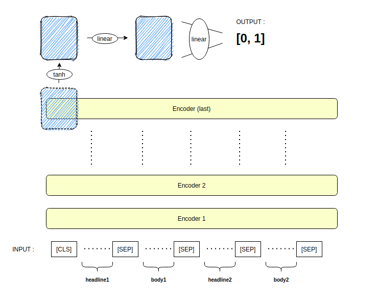
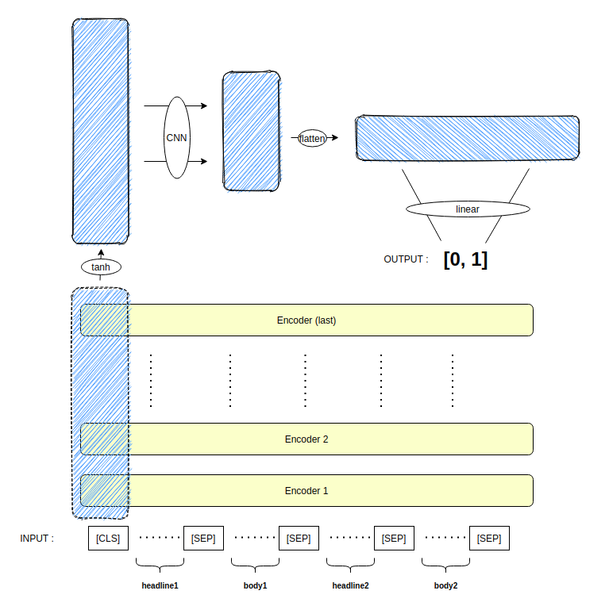

# HaaFor Challenge 2020
**Task**: Given two news articles with headlines, classify if the first article chronologically precedes the second article.

**Result**: ALBERT - Evaluation: 70.04% - 4th place 

## Data

### Data Preprocessing
- Augmentation (same as BERT NSP task)
    - 50% correct sequence (true)
    - 50% incorrect sequence (false)

- Headline and body preprocessing
    1. Concatenate with [SEP] token (best performance)
    2. Train separately
    3. Extract verbs and numbers only

- Data input format

    >input: 
        [[before_headline, before_body, after_headline, after_body], ... ]
    
    >output: 
        "[CLS] before_headline [SEP] before_body [SEP] after_headline [SEP] after_body"

## Model

### Baseline

1. BertModel
    * Accuracy: 0.50

2. BertForNextSentencePrediction
    * Accuracy: 0.51

### Custom headers on models

1. NSP header (as implemented in huggingface.co)
    * newly trained pooling layer for pooler output




2. Convolutional header 
    * Concatenate CLS token embeddings at each hidden layer
    * Apply CNN and fully connected layer to the concatenated CLS embeddings



### Model Implementation
- Hyperparameters

| Model       | Pretrained   | Batch Size  | Epochs | Learning Rate | Weight decay | Scheduling | Test Accuracy |
| ----------- |------------- | ----------- | ------ | ------------- | ------------ | ---------- | -------- |
| XLNet       | xlnet-base-cased | 64     | 2 | 1e-5 | 1e-2 | None | 0.5075 |
| XLNet       | xlnet-base-cased | 128    | 2 | 1e-5 | 1e-2 | cosine | 0.486 |
| Albert      | albert-base-v2   | 32     | 5 | 1e-5 | 1e-2 | None | 0.7278 |
| Albert      | albert-base-v2   | 128    | 5 | 1e-5 | 1e-2 | cosine | 0.7023 |
| **Albert (ConvNSP)**| **albert-base-v2**   | **64**     | **7** | **1e-5** | **1e-2** | **None** | **0.7401** |


* Due to the lack of computing power and time, models were not properly trained over an appropriate number of training cycles. Albert (ConvNSP) seems to have a good potential in achieving better performance under appropriate hyperparameter settings
  * Achieved better performance than the submitted Albert

* Ensembles could also have achieved better performance

</br>

##### Run Code examples

``` sh
python preprocess.py

-- albert
nohup python main.py \
    --batch_size 4 \
    --pretrainedPATH ./model_pretrained/albert-proper/ \
    --destination_folder ./result/albert-proper/ > ./result/albert-proper/train_albert_base_v2.txt

-- xlnet
nohup python main.py \
    --model xlnet-base-cased \
    --pretrainedPATH ./model_pretrained/xlnet/ \
    --batch_size 2 \
    --gradient_accumulation_steps 32 \
    --destination_folder ./result/xlnet-proper/ > ./result/xlnet-proper/train_based_cased.txt

-- albert with scheduler
nohup python main.py \
    --batch_size 4 \
    --gradient_accumulation_steps 32 \
    --pretrainedPATH ./model_pretrained/albert-scheduler/ \
    --destination_folder ./result/albert-scheduler/ > ./result/albert-scheduler/train_albert_base_v2.txt

-- xlnet scheduler
nohup python main.py \
    --model xlnet-base-cased \
    --pretrainedPATH ./model_pretrained/xlnet-scheduler/ \
    --batch_size 4 \
    --gradient_accumulation_steps 32 \
    --destination_folder ./result/xlnet-scheduler/ \
    --epochs 5 \
    --cls_pos -1 > ./result/xlnet-scheduler/train_xlnet_scheduler.txt

-- albert conv
nohup python main.py \
    --conv True \
    --batch_size 4 \
    --gradient_accumulation_steps 16 \
    --pretrainedPATH ./model_pretrained/albert-conv/ \
    --destination_folder ./result/albert-conv/ > ./result/albert-conv/train_albert_base_conv.txt


nohup python evaluate.py > final-result.txt
```